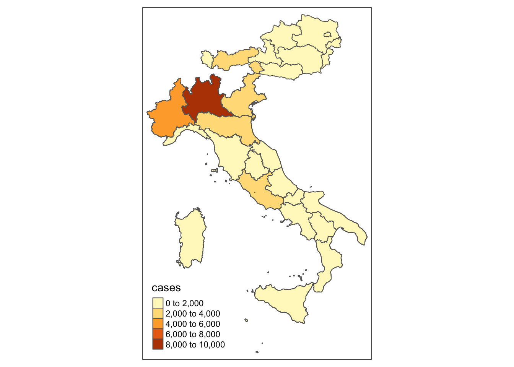

# European datasets


```r
library(knitr)
knitr::opts_chunk$set(message=FALSE)
```


```r
library(sars2pack)
library(eurostat)
library(dplyr)
library(tmap)
library(sf)
```


```r
eucov = eu_data_cache_data()
```


```r
geodata = get_eurostat_geospatial(output_class = "sf",
                                  resolution = "60",
                                  nuts_level = 2,
                                  year=2016)
## The names here need to be initialized to NULL
## for the join below to working
## See https://github.com/r-spatial/sf/issues/1177#issuecomment-541858742
head(names(geodata$geometry))
```

```
## [1] "0" "1" "2" "3" "4" "5"
```

```r
names(geodata$geometry)=NULL
```


```r
x = left_join(geodata, eucov, by=c('NUTS_NAME'='nuts_2'))
```


```r
tmap::tm_shape(geodata) + tm_polygons() 
```


```r
x %>% filter(date=='2020-04-01') %>% tmap::tm_shape() + tm_polygons(col='cases') 
```


