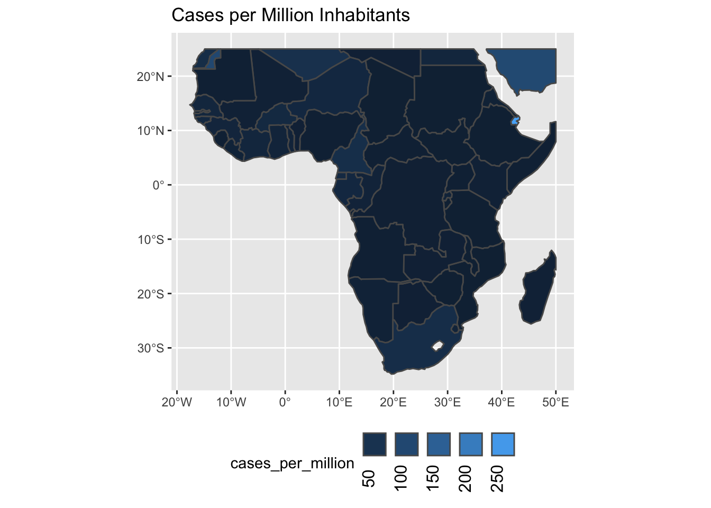

# Map visualizations


```r
library(tmap)
library(dplyr)
library(sars2pack)
library(htmltools)
library(htmlwidgets)
```


```r
ejhu = enriched_jhu_data()
```


```r
glimpse(ejhu)
```

```
## Rows: 38,332
## Columns: 20
## $ name           <chr> "Afghanistan", "Afghanistan", "Afghanistan", "Afghanis…
## $ topLevelDomain <list> [".af", ".af", ".af", ".af", ".af", ".af", ".af", ".a…
## $ alpha2Code     <chr> "AF", "AF", "AF", "AF", "AF", "AF", "AF", "AF", "AF", …
## $ alpha3Code     <chr> "AFG", "AFG", "AFG", "AFG", "AFG", "AFG", "AFG", "AFG"…
## $ capital        <chr> "Kabul", "Kabul", "Kabul", "Kabul", "Kabul", "Kabul", …
## $ region         <chr> "Asia", "Asia", "Asia", "Asia", "Asia", "Asia", "Asia"…
## $ subregion      <chr> "Southern Asia", "Southern Asia", "Southern Asia", "So…
## $ population     <int> 27657145, 27657145, 27657145, 27657145, 27657145, 2765…
## $ area           <dbl> 652230, 652230, 652230, 652230, 652230, 652230, 652230…
## $ gini           <dbl> 27.8, 27.8, 27.8, 27.8, 27.8, 27.8, 27.8, 27.8, 27.8, …
## $ borders        <list> [<"IRN", "PAK", "TKM", "UZB", "TJK", "CHN">, <"IRN", …
## $ numericCode    <chr> "004", "004", "004", "004", "004", "004", "004", "004"…
## $ cioc           <chr> "AFG", "AFG", "AFG", "AFG", "AFG", "AFG", "AFG", "AFG"…
## $ ProvinceState  <chr> NA, NA, NA, NA, NA, NA, NA, NA, NA, NA, NA, NA, NA, NA…
## $ CountryRegion  <chr> "Afghanistan", "Afghanistan", "Afghanistan", "Afghanis…
## $ Lat            <dbl> 33, 33, 33, 33, 33, 33, 33, 33, 33, 33, 33, 33, 33, 33…
## $ Long           <dbl> 65, 65, 65, 65, 65, 65, 65, 65, 65, 65, 65, 65, 65, 65…
## $ date           <date> 2020-01-22, 2020-01-23, 2020-01-24, 2020-01-25, 2020-…
## $ count          <dbl> 0, 0, 0, 0, 0, 0, 0, 0, 0, 0, 0, 0, 0, 0, 0, 0, 0, 0, …
## $ subset         <chr> "confirmed", "confirmed", "confirmed", "confirmed", "c…
```

We need a description of the regions of the world.


```r
data(World)
```

The `World` object has a column, `geometry`, that describes the shape of each country
in the `World` dataset. Join the `ejhu` data.frame with the `World` data using
`dplyr` join as normal.


```r
geo_ejhu = World %>%
    dplyr::left_join(ejhu, by = c('iso_a3' = 'alpha3Code'))
```


```r
w2 = geo_ejhu %>%
    filter(!is.na(date) & subset=='confirmed') %>%
    group_by(iso_a3) %>%
    filter(date==max(date)) %>%
    mutate(cases_per_million = 1000000*count/pop_est)
```

The R package `ggplot2` has geospatial plotting capabilities built in for
geospatial `simple features (sf)` data types. In this first plot, we focus
in on Europe.


```r
library(ggplot2)
# transform to lat/long coordinates
st_transform(w2, crs=4326) %>%
# Crop to europe (rough, by hand)
    st_crop(xmin=-20,xmax=45,ymin=35,ymax=70) %>%
ggplot() +
    geom_sf(aes(fill=cases_per_million)) +
    scale_fill_continuous(
        guide=guide_legend(label.theme = element_text(angle = 90),
                           label.position='bottom')
        ) + 
    labs(title='Cases per Million Inhabitants') +
    theme(legend.position='bottom')
```


Another plot, but now for Africa.


```r
library(ggplot2)
# transform to lat/long coordinates
st_transform(w2, crs=4326) %>%
# Crop to europe (rough, by hand)
    st_crop(xmin=-20,xmax=50,ymin=-60,ymax=25) %>%
ggplot() +
    geom_sf(aes(fill=cases_per_million)) +
    scale_fill_continuous(
        guide=guide_legend(label.theme = element_text(angle = 90),
                           label.position='bottom')
        ) + 
    labs(title='Cases per Million Inhabitants') +
    theme(legend.position='bottom')
```



## Interactive maps

The following will not produce a plot when run
non-interactively. However, pasting this into your R session will
result in an interactive plot with multiple "layers" that you can
choose to visualize different quantitative variables on the
map. Zooming also works as expected.


```r
tmap_mode('view')
## geo_ejhu %>%
##     filter(!is.na(date) & subset=='confirmed') %>%
##     group_by(iso_a3) %>%
##     filter(date==max(date)) %>%
##     tm_shape() +
##         tm_polygons(col='count')
w2 = geo_ejhu %>%
    filter(!is.na(date) & subset=='confirmed') %>%
    group_by(iso_a3) %>%
    filter(date==max(date)) %>%
    mutate(cases_per_million = 1000000*count/pop_est) %>%
    filter(region == 'Africa')
m = tm_shape(w2,id='name.x', name=c('cases_per_million'),popup=c('pop_est')) +
    tm_polygons(c('Cases Per Million' = 'cases_per_million','Cases' = 'count',"Well-being index"='well_being', 'GINI'='gini'),
                selected='cases_per_million',
                border.alpha = 0.5,
                alpha=0.6,
                popup.vars=c('Cases Per Million'='cases_per_million',
                             'Confirmed Cases'  ='count',
                             'Population'       ='pop_est',
                             'gini'             ='gini',
                             'Life Expectancy'  ='life_exp')) +
    tm_facets(as.layers = TRUE)
tmap_save(m, filename='abc.html')
```


