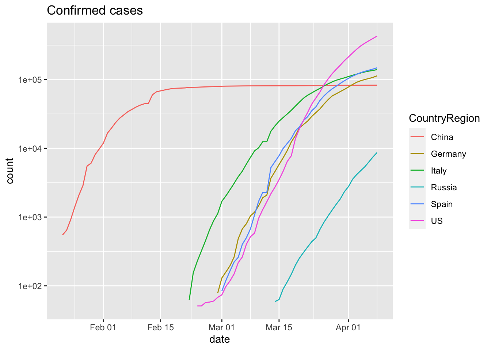

```
## Warning: package 'tibble' was built under R version 3.6.2
```

# Quick start

## Installation


```r
BiocManager::install('seandavi/sars2pack')
```

[sars2pack]: https://github.com/seandavi/sars2pack
[New York Times]: https://github.com/nytimes/covid-19-data
[JHU]: https://github.com/CSSEGISandData/COVID-19/tree/master/csse_covid_19_data/
[USAFacts]:  https://usafacts.org/visualizations/coronavirus-covid-19-spread-map/
[pull request]: https://github.com/seandavi/sars2pack/compare
[issue]: https://github.com/seandavi/sars2pack/issues/new

## COVID-19 resources in this package

The COVID-19 data in this package are, right now, focused toward 
time-series descriptions of confirmed cases, deaths, testing, and
recovered cases. **There is no requirement that this remain the case**.
Contributions of additional data resources or simple accessor functions
will only add to our abilities to use data science and modeling
to understand COVID-19.

*Request for help*: I would be more than happy to accept help with 
defining new data resources. Consider a [pull request] (or an [issue] for
non-programmer types). 

### Epidemic time-series data

- [JHU] : global deaths, confirmed cases, and recovered time series
  data; *does not include fine-level United States data*. See
  `jhu_data()`.
- [New York Times] : United states state and county level deaths,
  confirmed cases time series. See `nytimes_county_data()` and
  `nytimes_state_data`.
- [USAFacts] : Alternative United states state and county level deaths
  and confirmed cases time series

## Additional resources described in this vignette


- 


# Epidemic time series data

Usage of each of the time series datasets follows a similar pattern. 

1. Fetch a tidy `tbl_df` using a function such as `jhu_data()`
2. In the resulting `tbl_df`, the columns `date` (of type `date`) and
   `count` of type `numeric` columns are standard.
3. Additional columns describe locations, subsets of data (such as
   `confirmed`, `deaths`, `recovered`) and vary from dataset to
   dataset. 

Regardless of the original format of the data, the `sars2pack`
datasets are presented as [tidy data] to facilitate `dplyr`, `ggplot`,
and other fluid analysis approaches to apply directly.

[tidy data]: https://cran.r-project.org/web/packages/tidyr/vignettes/tidy-data.html

## Access data

This section briefly introduces how to access the data
resources in this package. Note that many of the functions
below **require a network connection** to get updated data.

### JHU Dataset


```r
jhu = jhu_data()
class(jhu)
```

```
## [1] "tbl_df"     "tbl"        "data.frame"
```

```r
dim(jhu)
```

```
## [1] 38332     7
```

Column names include:


```r
colnames(jhu)
```

```
## [1] "ProvinceState" "CountryRegion" "Lat"           "Long"         
## [5] "date"          "count"         "subset"
```

And a very small subset of the data. 


```r
head(jhu,3)
```

```
## # A tibble: 3 x 7
##   ProvinceState CountryRegion   Lat  Long date       count subset   
##   <chr>         <chr>         <dbl> <dbl> <date>     <dbl> <chr>    
## 1 <NA>          Afghanistan      33    65 2020-01-22     0 confirmed
## 2 <NA>          Afghanistan      33    65 2020-01-23     0 confirmed
## 3 <NA>          Afghanistan      33    65 2020-01-24     0 confirmed
```


### USAFacts Dataset


```r
usa_facts = usa_facts_data()
class(usa_facts)
```

```
## [1] "tbl_df"     "tbl"        "data.frame"
```

```r
dim(usa_facts)
```

```
## [1] 434792      7
```

Column names include:


```r
colnames(usa_facts)
```

```
## [1] "county_fips" "county"      "state"       "state_fips"  "subset"     
## [6] "date"        "count"
```

And a very small subset of the data. 


```r
head(usa_facts,3)
```

```
## # A tibble: 3 x 7
##   county_fips county                state state_fips subset    date       count
##         <dbl> <chr>                 <chr>      <dbl> <chr>     <date>     <dbl>
## 1           0 Statewide Unallocated AL             1 confirmed 2020-01-22     0
## 2           0 Statewide Unallocated AL             1 confirmed 2020-01-23     0
## 3           0 Statewide Unallocated AL             1 confirmed 2020-01-24     0
```


### NYTimes datasets


```r
nytimes_state = nytimes_state_data()
class(nytimes_state)
```

```
## [1] "tbl_df"     "tbl"        "data.frame"
```

```r
dim(nytimes_state)
```

```
## [1] 3658    5
```

Column names include:


```r
colnames(nytimes_state)
```

```
## [1] "date"   "state"  "fips"   "count"  "subset"
```

And a very small subset of the data. 


```r
head(nytimes_state,3)
```

```
## # A tibble: 3 x 5
##   date       state      fips  count subset   
##   <date>     <chr>      <chr> <dbl> <chr>    
## 1 2020-01-21 Washington 00053     1 confirmed
## 2 2020-01-22 Washington 00053     1 confirmed
## 3 2020-01-23 Washington 00053     1 confirmed
```


```r
nytimes_county = nytimes_county_data()
class(nytimes_county)
```

```
## [1] "tbl_df"     "tbl"        "data.frame"
```

```r
dim(nytimes_county)
```

```
## [1] 66502     6
```

```r
colnames(nytimes_county)
```

```
## [1] "date"   "county" "state"  "fips"   "count"  "subset"
```

# Use cases

## Basic data exploration

In this section, we will be using a combination of [dplyr] and
[ggplot2] to explore the COVID-19 global data from JHU. For details on
this dataset, see the help using `?jhu_data`.

The next line of code will do a (set of) network calls to fetch the
most up-to-date dataset from the JHU github repository.


```r
jhu = jhu_data()
head(jhu,3)
```

```
## # A tibble: 3 x 7
##   ProvinceState CountryRegion   Lat  Long date       count subset   
##   <chr>         <chr>         <dbl> <dbl> <date>     <dbl> <chr>    
## 1 <NA>          Afghanistan      33    65 2020-01-22     0 confirmed
## 2 <NA>          Afghanistan      33    65 2020-01-23     0 confirmed
## 3 <NA>          Afghanistan      33    65 2020-01-24     0 confirmed
```

We now want to ask a series of questions about the dataset. 

- **How many records are in the dataset?**


```r
nrow(jhu)
```

```
## [1] 38332
```

- **How many different countries are represented?**


```r
length(unique(jhu$CountryRegion))
```

```
## [1] 181
```

Most records have no listing for `ProvinceState` column. Let's look at
a few of those to get an idea of what is there when not empty:

- **What is in the `ProvinceState` column?**

To answer this question, we will be using `dplyr`, so some familiarity
with that package will be helpful to follow this code.


```r
jhu %>%
    dplyr::filter(!is.na(ProvinceState)) %>%
    dplyr::select(ProvinceState, CountryRegion) %>%
    unique() %>%
    head(10)
```

```
## # A tibble: 10 x 2
##    ProvinceState                CountryRegion
##    <chr>                        <chr>        
##  1 Australian Capital Territory Australia    
##  2 New South Wales              Australia    
##  3 Northern Territory           Australia    
##  4 Queensland                   Australia    
##  5 South Australia              Australia    
##  6 Tasmania                     Australia    
##  7 Victoria                     Australia    
##  8 Western Australia            Australia    
##  9 Alberta                      Canada       
## 10 British Columbia             Canada
```

We still have not looked at the most valuable information, the `date`
and `count` columns in any detail.

- **What is the current count of confirmed cases by country, ordered
  by highest count down?**

There is a lot to unpack in the next code block, but the results are
quite useful. We will use the [DT] package to make the dataset searchable
and sortable.


```r
library(DT)
latest_jhu_data = jhu %>%
    dplyr::filter(subset=='confirmed' & is.na(ProvinceState)) %>%
    dplyr::group_by(CountryRegion) %>%
    dplyr::slice(which.max(date)) %>%
    dplyr::arrange(desc(count))
DT::datatable(latest_jhu_data, rownames=FALSE)
```

<!--html_preserve--><div id="htmlwidget-b9549ce2b4f6b501f299" style="width:100%;height:auto;" class="datatables html-widget"></div>
<script type="application/json" data-for="htmlwidget-b9549ce2b4f6b501f299">{"x":{"filter":"none","data":[[null,null,null,null,null,null,null,null,null,null,null,null,null,null,null,null,null,null,null,null,null,null,null,null,null,null,null,null,null,null,null,null,null,null,null,null,null,null,null,null,null,null,null,null,null,null,null,null,null,null,null,null,null,null,null,null,null,null,null,null,null,null,null,null,null,null,null,null,null,null,null,null,null,null,null,null,null,null,null,null,null,null,null,null,null,null,null,null,null,null,null,null,null,null,null,null,null,null,null,null,null,null,null,null,null,null,null,null,null,null,null,null,null,null,null,null,null,null,null,null,null,null,null,null,null,null,null,null,null,null,null,null,null,null,null,null,null,null,null,null,null,null,null,null,null,null,null,null,null,null,null,null,null,null,null,null,null,null,null,null,null,null,null,null,null,null,null,null,null,null,null,null,null,null,null,null,null,null],["US","Spain","Italy","Germany","France","Iran","United Kingdom","Turkey","Switzerland","Belgium","Netherlands","Austria","Portugal","Brazil","Korea, South","Israel","Sweden","Norway","Russia","Ireland","Czechia","Chile","Denmark","Poland","Romania","Malaysia","Ecuador","Japan","Philippines","India","Pakistan","Luxembourg","Saudi Arabia","Indonesia","Thailand","Finland","Peru","Mexico","Greece","Panama","Serbia","South Africa","United Arab Emirates","Dominican Republic","Argentina","Iceland","Colombia","Qatar","Algeria","Ukraine","Singapore","Croatia","Egypt","Estonia","Slovenia","New Zealand","Morocco","Iraq","Lithuania","Armenia","Moldova","Diamond Princess","Bahrain","Hungary","Bosnia and Herzegovina","Cameroon","Tunisia","Kazakhstan","Azerbaijan","Lebanon","Latvia","Bulgaria","North Macedonia","Kuwait","Slovakia","Andorra","Belarus","Costa Rica","Cyprus","Uruguay","Taiwan*","Albania","Jordan","Burkina Faso","Afghanistan","Cuba","Oman","Uzbekistan","Honduras","San Marino","Cote d'Ivoire","Vietnam","Senegal","West Bank and Gaza","Nigeria","Malta","Ghana","Montenegro","Mauritius","Sri Lanka","Georgia","Venezuela","Congo (Kinshasa)","Kyrgyzstan","Niger","Bolivia","Brunei","Kosovo","Kenya","Cambodia","Guinea","Trinidad and Tobago","Rwanda","Paraguay","Liechtenstein","Bangladesh","Madagascar","Monaco","Guatemala","El Salvador","Jamaica","Barbados","Djibouti","Uganda","Mali","Togo","Zambia","Ethiopia","Eritrea","Bahamas","Guyana","Congo (Brazzaville)","Burma","Gabon","Haiti","Tanzania","Maldives","Guinea-Bissau","Libya","Benin","Equatorial Guinea","Syria","Antigua and Barbuda","Dominica","Mongolia","Namibia","Saint Lucia","Fiji","Grenada","Angola","Laos","Liberia","Mozambique","Seychelles","Sudan","Suriname","Chad","Eswatini","MS Zaandam","Nepal","Saint Kitts and Nevis","Zimbabwe","Central African Republic","Cabo Verde","Holy See","Saint Vincent and the Grenadines","Somalia","Mauritania","Bhutan","Nicaragua","Belize","Botswana","Gambia","Malawi","Sierra Leone","Burundi","Papua New Guinea","Timor-Leste"],[37.0902,40,43,51,46.2276,32,55.3781,38.9637,46.8182,50.8333,52.1326,47.5162,39.3999,-14.235,36,31,63,60.472,60,53.1424,49.8175,-35.6751,56.2639,51.9194,45.9432,2.5,-1.8312,36,13,21,30.3753,49.8153,24,-0.7893,15,64,-9.19,23.6345,39.0742,8.538,44.0165,-30.5595,24,18.7357,-38.4161,64.9631,4.5709,25.3548,28.0339,48.3794,1.2833,45.1,26,58.5953,46.1512,-40.9006,31.7917,33,55.1694,40.0691,47.4116,0,26.0275,47.1625,43.9159,3.848,34,48.0196,40.1431,33.8547,56.8796,42.7339,41.6086,29.5,48.669,42.5063,53.7098,9.7489,35.1264,-32.5228,23.7,41.1533,31.24,12.2383,33,22,21,41.3775,15.2,43.9424,7.54,16,14.4974,31.9522,9.082,35.9375,7.9465,42.5,-20.2,7,42.3154,6.4238,-4.0383,41.2044,17.6078,-16.2902,4.5353,42.602636,-0.0236,11.55,9.9456,10.6918,-1.9403,-23.4425,47.14,23.685,-18.7669,43.7333,15.7835,13.7942,18.1096,13.1939,11.8251,1,17.570692,8.6195,-15.4167,9.145,15.1794,25.0343,5,-4.0383,21.9162,-0.8037,18.9712,-6.369,3.2028,11.8037,26.3351,9.3077,1.5,34.802075,17.0608,15.415,46.8625,-22.9576,13.9094,-17.7134,12.1165,-11.2027,19.85627,6.4281,-18.665695,-4.6796,12.8628,3.9193,15.4542,-26.5225,0,28.1667,17.357822,-20,6.6111,16.5388,41.9029,12.9843,5.1521,21.0079,27.5142,12.8654,13.1939,-22.3285,13.4432,-13.254308,8.460555,-3.3731,-6.315,-8.874217],[-95.7129,-4,12,9,2.2137,53,-3.436,35.2433,8.2275,4,5.2913,14.5501,-8.2245,-51.9253,128,35,16,8.4689,90,-7.6921,15.473,-71.543,9.5018,19.1451,24.9668,112.5,-78.1834,138,122,78,69.3451,6.1296,45,113.9213,101,26,-75.0152,-102.5528,21.8243,-80.7821,21.0059,22.9375,54,-70.1627,-63.6167,-19.0208,-74.2973,51.1839,1.6596,31.1656,103.8333,15.2,30,25.0136,14.9955,174.886,-7.0926,44,23.8813,45.0382,28.3699,0,50.55,19.5033,17.6791,11.5021,9,66.9237,47.5769,35.8623,24.6032,25.4858,21.7453,47.75,19.699,1.5218,27.9534,-83.7534,33.4299,-55.7658,121,20.1683,36.51,-1.5616,65,-80,57,64.5853,-86.2419,12.4578,-5.5471,108,-14.4524,35.2332,8.6753,14.3754,-1.0232,19.3,57.5,81,43.3569,-66.5897,21.7587,74.7661,8.0817,-63.5887,114.7277,20.902977,37.9062,104.9167,-9.6966,-61.2225,29.8739,-58.4438,9.55,90.3563,46.8691,7.4167,-90.2308,-88.8965,-77.2975,-59.5432,42.5903,32,-3.996166,0.8248,28.2833,40.4897,39.7823,-77.3963,-58.75,21.7587,95.956,11.6094,-72.2852,34.8888,73.2207,-15.1804,17.228331,2.3158,10,38.996815,-61.7964,-61.371,103.8467,18.4904,-60.9789,178.065,-61.679,17.8739,102.495496,-9.4295,35.529562,55.492,30.2176,-56.0278,18.7322,31.4659,0,84.25,-62.782998,30,20.9394,-23.0418,12.4534,-61.2872,46.1996,10.9408,90.4336,-85.2072,-59.5432,24.6849,-15.3101,34.301525,-11.779889,29.9189,143.9555,125.727539],["2020-04-04","2020-04-04","2020-04-04","2020-04-04","2020-04-04","2020-04-04","2020-04-04","2020-04-04","2020-04-04","2020-04-04","2020-04-04","2020-04-04","2020-04-04","2020-04-04","2020-04-04","2020-04-04","2020-04-04","2020-04-04","2020-04-04","2020-04-04","2020-04-04","2020-04-04","2020-04-04","2020-04-04","2020-04-04","2020-04-04","2020-04-04","2020-04-04","2020-04-04","2020-04-04","2020-04-04","2020-04-04","2020-04-04","2020-04-04","2020-04-04","2020-04-04","2020-04-04","2020-04-04","2020-04-04","2020-04-04","2020-04-04","2020-04-04","2020-04-04","2020-04-04","2020-04-04","2020-04-04","2020-04-04","2020-04-04","2020-04-04","2020-04-04","2020-04-04","2020-04-04","2020-04-04","2020-04-04","2020-04-04","2020-04-04","2020-04-04","2020-04-04","2020-04-04","2020-04-04","2020-04-04","2020-04-04","2020-04-04","2020-04-04","2020-04-04","2020-04-04","2020-04-04","2020-04-04","2020-04-04","2020-04-04","2020-04-04","2020-04-04","2020-04-04","2020-04-04","2020-04-04","2020-04-04","2020-04-04","2020-04-04","2020-04-04","2020-04-04","2020-04-04","2020-04-04","2020-04-04","2020-04-04","2020-04-04","2020-04-04","2020-04-04","2020-04-04","2020-04-04","2020-04-04","2020-04-04","2020-04-04","2020-04-04","2020-04-04","2020-04-04","2020-04-04","2020-04-04","2020-04-04","2020-04-04","2020-04-04","2020-04-04","2020-04-04","2020-04-04","2020-04-04","2020-04-04","2020-04-04","2020-04-04","2020-04-04","2020-04-04","2020-04-04","2020-04-04","2020-04-04","2020-04-04","2020-04-04","2020-04-04","2020-04-04","2020-04-04","2020-04-04","2020-04-04","2020-04-04","2020-04-04","2020-04-04","2020-04-04","2020-04-04","2020-04-04","2020-04-04","2020-04-04","2020-04-04","2020-04-04","2020-04-04","2020-04-04","2020-04-04","2020-04-04","2020-04-04","2020-04-04","2020-04-04","2020-04-04","2020-04-04","2020-04-04","2020-04-04","2020-04-04","2020-04-04","2020-04-04","2020-04-04","2020-04-04","2020-04-04","2020-04-04","2020-04-04","2020-04-04","2020-04-04","2020-04-04","2020-04-04","2020-04-04","2020-04-04","2020-04-04","2020-04-04","2020-04-04","2020-04-04","2020-04-04","2020-04-04","2020-04-04","2020-04-04","2020-04-04","2020-04-04","2020-04-04","2020-04-04","2020-04-04","2020-04-04","2020-04-04","2020-04-04","2020-04-04","2020-04-04","2020-04-04","2020-04-04","2020-04-04","2020-04-04","2020-04-04","2020-04-04"],[308850,126168,124632,96092,89953,55743,41903,23934,20505,18431,16627,11781,10524,10360,10156,7851,6443,5550,4731,4604,4472,4161,4077,3627,3613,3483,3465,3139,3094,3082,2818,2729,2179,2092,2067,1882,1746,1688,1673,1673,1624,1585,1505,1488,1451,1417,1406,1325,1251,1225,1189,1126,1070,1039,977,950,919,878,771,770,752,712,688,678,624,555,553,531,521,520,509,503,483,479,471,466,440,435,426,400,355,333,323,318,299,288,277,266,264,259,245,240,219,217,214,213,205,201,196,166,162,155,154,144,144,139,135,135,126,114,111,103,102,96,77,70,70,66,61,56,53,52,50,48,41,41,39,38,29,28,23,22,21,21,20,20,19,18,18,16,16,16,15,14,14,14,14,12,12,10,10,10,10,10,10,10,9,9,9,9,9,9,8,7,7,7,7,6,5,5,4,4,4,4,4,3,1,1],["confirmed","confirmed","confirmed","confirmed","confirmed","confirmed","confirmed","confirmed","confirmed","confirmed","confirmed","confirmed","confirmed","confirmed","confirmed","confirmed","confirmed","confirmed","confirmed","confirmed","confirmed","confirmed","confirmed","confirmed","confirmed","confirmed","confirmed","confirmed","confirmed","confirmed","confirmed","confirmed","confirmed","confirmed","confirmed","confirmed","confirmed","confirmed","confirmed","confirmed","confirmed","confirmed","confirmed","confirmed","confirmed","confirmed","confirmed","confirmed","confirmed","confirmed","confirmed","confirmed","confirmed","confirmed","confirmed","confirmed","confirmed","confirmed","confirmed","confirmed","confirmed","confirmed","confirmed","confirmed","confirmed","confirmed","confirmed","confirmed","confirmed","confirmed","confirmed","confirmed","confirmed","confirmed","confirmed","confirmed","confirmed","confirmed","confirmed","confirmed","confirmed","confirmed","confirmed","confirmed","confirmed","confirmed","confirmed","confirmed","confirmed","confirmed","confirmed","confirmed","confirmed","confirmed","confirmed","confirmed","confirmed","confirmed","confirmed","confirmed","confirmed","confirmed","confirmed","confirmed","confirmed","confirmed","confirmed","confirmed","confirmed","confirmed","confirmed","confirmed","confirmed","confirmed","confirmed","confirmed","confirmed","confirmed","confirmed","confirmed","confirmed","confirmed","confirmed","confirmed","confirmed","confirmed","confirmed","confirmed","confirmed","confirmed","confirmed","confirmed","confirmed","confirmed","confirmed","confirmed","confirmed","confirmed","confirmed","confirmed","confirmed","confirmed","confirmed","confirmed","confirmed","confirmed","confirmed","confirmed","confirmed","confirmed","confirmed","confirmed","confirmed","confirmed","confirmed","confirmed","confirmed","confirmed","confirmed","confirmed","confirmed","confirmed","confirmed","confirmed","confirmed","confirmed","confirmed","confirmed","confirmed","confirmed","confirmed","confirmed","confirmed","confirmed","confirmed","confirmed","confirmed","confirmed"]],"container":"<table class=\"display\">\n  <thead>\n    <tr>\n      <th>ProvinceState<\/th>\n      <th>CountryRegion<\/th>\n      <th>Lat<\/th>\n      <th>Long<\/th>\n      <th>date<\/th>\n      <th>count<\/th>\n      <th>subset<\/th>\n    <\/tr>\n  <\/thead>\n<\/table>","options":{"columnDefs":[{"className":"dt-right","targets":[2,3,5]}],"order":[],"autoWidth":false,"orderClasses":false}},"evals":[],"jsHooks":[]}</script><!--/html_preserve-->

**Note**: I included a little `is.na` in the filtering above to remove
records where country data are split out over subparts. We revisit
this below.

[DT]: https://rstudio.github.io/DT/

The data here could be usefully displayed as a graph as well.


```r
par(las=2, mar=c(8,5,5,1))
barplot(count ~ CountryRegion, xlab = '',
        data=head(latest_jhu_data,10),
        main='Confirmed cases, top 10 countries')
```


We note here that China is not shown. That is because we limited the
data to only rows that had empty ProvinceState records. To add those
records back in, we sum all the China rows (and those of other
countries like Australia, etc.) by country and then perform similar
work to produce a final plot.


```r
latest_jhu_data = jhu %>%
    dplyr::filter(subset=='confirmed') %>%
    dplyr::select(-c(ProvinceState,Lat,Long)) %>%
    dplyr::group_by(CountryRegion,date) %>%
    dplyr::summarize(count = sum(count)) %>%
    dplyr::slice(which.max(date)) %>%
    dplyr::arrange(desc(count))
par(las=2, mar=c(8,5,5,1))
barplot(count ~ CountryRegion, xlab = '',
        data=head(latest_jhu_data,10),
        main='Confirmed cases, top 10 countries')
```


## Visualize time series data

Up to now, we have ignored the time series aspects of the data and
have sliced the dataset by country. In this section, we will be using
dplyr and ggplot2 to visualize disease infection and deaths over time.

- **How have the cases in Italy changed over time?**


```r
library(ggplot2)
italy_cc_ts = jhu %>%
    dplyr::filter(CountryRegion == 'Italy' & subset=='confirmed')
ggplot(italy_cc_ts,aes(x=date, y=count)) +
    geom_line() +
    ggtitle('Confirmed cases') 
```


- **How do the confirmed cases in China, US, Italy, Spain, Germany,
  and Russia compare over time?**

We have to play the same game of summing all values by country and
date. Here, we filter the countries to be in a list of countries.


```r
countries_of_interest = c('China','US','Italy','Spain','Germany','Russia')
library(ggplot2)
cc_ts = jhu %>%
    dplyr::group_by(CountryRegion,date) %>%
    dplyr::filter(CountryRegion %in% countries_of_interest & subset=='confirmed') %>%
    dplyr::summarize(count = sum(count))
head(cc_ts)
```

```
## # A tibble: 6 x 3
## # Groups:   CountryRegion [1]
##   CountryRegion date       count
##   <chr>         <date>     <dbl>
## 1 China         2020-01-22   548
## 2 China         2020-01-23   643
## 3 China         2020-01-24   920
## 4 China         2020-01-25  1406
## 5 China         2020-01-26  2075
## 6 China         2020-01-27  2877
```

To make the plot, we use the ggplot2 grouping and coloring to provide
curves for each country on the same axis.


```r
ggplot(cc_ts,aes(x=date, y=count, group=CountryRegion)) +
    geom_line(aes(color=CountryRegion)) +
    ggtitle('Confirmed cases') 
```


Changing to log scale can give a sense of the "exponentialness" of
these data. Also, to remove zeros from the data (which cause problems
when taking logs), we can filter data to include only values
>=50. Note that ggplot2 will "do the right thing".


```r
cc_ts %>%
    dplyr::filter(count>=50) %>%
    ggplot(aes(x=date, y=count, group=CountryRegion)) +
    geom_line(aes(color=CountryRegion)) +
    ggtitle('Confirmed cases') +
    scale_y_log10()
```



Consider the following questions based on the figure:

- What does the slope of the lines in this plot represent?
- What is the difference between China and other countries? What does
  this difference mean in terms of how the disease is spreading?
- What does each
- Pick an arbitrary level on the y-axis and look at the dates
  associated with each country's curve with respect to that
  level. What do differences along the x-axis tell us about where the
  countries are with respect to disease process?


